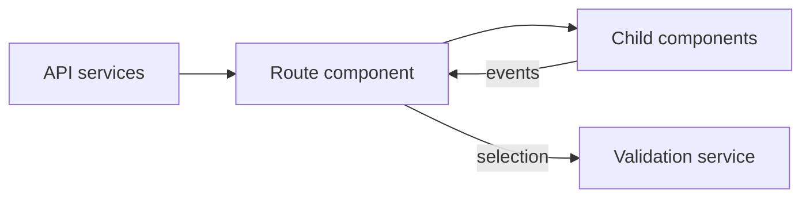

This page explains how the Angular client is organized: its routes, its folders, and how data flows from the server
into the views. Read it before you add a component or a client feature.

## Routes

The client has two routes, both defined in `src/main/webapp/app/app.routes.ts` and loaded lazily:

| Path | View |
|---|---|
| `/feature-model/configurator` | The **Configurator**; the empty path redirects here |
| `/feature-model/explorer` | The **Explorer**; every unknown path redirects here |

`app.component.ts` holds the navigation bar with links to both views. `app.config.ts` registers the router and the
HTTP client.

## Folder layout

All feature code lives in `src/main/webapp/app/feature-model/`:

| Folder | Contains |
|---|---|
| `core` | Shared TypeScript interfaces of the REST contract and pure helper functions, such as tree filtering |
| `api` | `FeatureModelService`, which wraps every REST call except validation |
| `validation` | `FeatureModelValidationService`, which sends a selection to the validation endpoint |
| `explorer` | The read-only Explorer: list view, diagram view, and details panel |
| `configurator` | The Configurator route component and its parts |
| `configurator/guided` | The guided workflow: templates, decision steps, and the review page |
| `configurator/guided/tutorial` | The first-run tutorial panel |
| `configurator/tree` | The advanced tree inside the Configurator |
| `configurator/shared` | Configurator types, selection helpers, deployment targets, and the validation issue list |

Global styles are in `src/main/webapp/content/scss/global.scss`, and tutorial images are in
`src/main/webapp/content/img/`.

## Data flow

The server owns the model. The client fetches it on every visit and never keeps its own copy of features, rules, or
workflow text. When the model changes, the client shows the change without a client release.

A route component loads its data through the API services and keeps all state in signals. Child components, such as
the guided workflow and the advanced tree, receive data through inputs and report user actions through outputs. In the
Configurator, the route component owns the selection. After every change, it sends the selection to the validation
service and shows the newest answer.

## Talking to the server

During development, the Angular dev server on port 9090 forwards every `/api` request to the Spring Boot server on
port 8090 (`proxy.conf.json`). The client always calls relative URLs such as `/api/feature-model`, so it needs no
server address.

In the runnable jar, the server delivers the client from its static resources. `SpaForwardController` answers the
client routes `/`, `/feature-model`, and `/feature-model/**` with `index.html`, so that a reload or a bookmarked link
opens the right view.

## Building the client into the jar

`./gradlew bootJar` runs the Angular production build (`npm run build:prod`) and copies `build/webapp/browser` into the
jar. Only the production build enforces the size budgets in `angular.json`, so run `npm run build:prod` before you
push larger style changes. [Setup](/developer/setup#build-one-runnable-jar) shows the commands.
