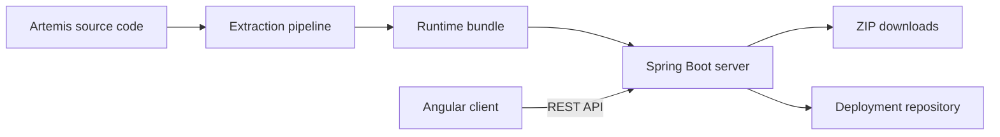

This page shows the whole system on one page: its parts, how a request moves through them, and what the system
deliberately leaves out. Read it before you dive into a single module.

## What the system does

The Artemis Feature Model describes the optional features of Artemis and the rules between them. Users explore the
model in the **Explorer** and build a valid selection in the **Configurator**. For a valid selection, the server
generates configuration files and deployment packages that switch the selected features on in an Artemis
installation.

The model itself comes from the Artemis source code. An extraction pipeline reads a checkout of Artemis, applies a
curated manifest, and produces a validated bundle that the server loads.

## The big picture

The diagram shows the main parts and the direction in which data flows.

The **runtime bundle** is the feature model, the guided workflow, and the Artemis config-key catalog, loaded together.
In development, the server reads it from classpath resources; in production-like runs, it reads one generated
snapshot. The extraction pipeline runs as Gradle commands, separate from the server.

## Main flows

| Flow | What happens |
|---|---|
| Explore | The client loads the model with `GET /api/feature-model` and renders it as a tree, a list, or a diagram. |
| Configure | The client loads the model, the guided workflow, and feature availability. After every change, it sends the selection to `POST /api/feature-model/validate` and shows the result. |
| Export | For a valid selection, the client asks the server for a deployment package. The server validates the selection again, generates the files, and returns them as a ZIP file. |
| Publish | For the remote server target, the server can also commit the generated package to a Git deployment repository. |

The server never trusts the client: it validates a selection again before it generates anything.

## Technology stack

| Part | Technology |
|---|---|
| Server | Spring Boot 4, Java 25, Gradle |
| Client | Angular 21 with standalone components and signals, TypeScript, SCSS with Bootstrap |
| Tests | JUnit with Spring Boot test support on the server, Vitest on the client |
| Runtime model | JSON files on the classpath or in a snapshot directory |
| Container image | One jar with the client inside and one embedded snapshot |

## What the system leaves out

The application has no database. The model is read-only, and a selection lives only in the browser until the user
downloads a package, so nothing needs to be stored.

It has no authentication. Every user sees the same model and can generate the same packages, and the application
holds no personal data.

It never starts or calls Artemis. It reads Artemis source code during extraction, and it generates files that an
administrator applies to an Artemis installation.

## Pages in this section

| Page | Covers |
|---|---|
| [Key Concepts](/developer/architecture/concepts) | The terms used throughout this guide |
| [Runtime Model](/developer/architecture/runtime-model) | How the server loads and validates the model at startup |
| [Server Structure](/developer/architecture/server) | Server packages, their layers, and how errors reach the client |
| [Client Structure](/developer/architecture/client) | Routes, folders, and data flow in the Angular client |
