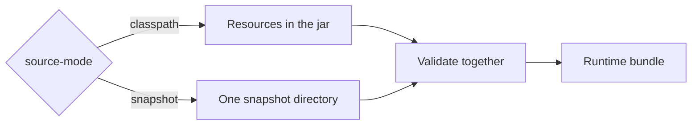

This page explains what the server loads at startup, where it loads it from, and what happens when the loaded data
is invalid. Read it when you change one of the model files or run the server with a generated snapshot.

## The runtime bundle

The server works with three files that must fit together:

| File | Content |
|---|---|
| Feature model | Features, relations, constraints, and artifact mappings |
| Guided workflow | Templates, steps, decisions, and the text of the Configurator |
| Artemis config-key catalog | Every Artemis configuration key the overlay may use, with its value type |

The guided workflow refers to features of the model, and the model's artifact mappings refer to keys of the catalog.
If one file changes without the others, these references break. The server therefore loads the three files as one
**runtime bundle**, checks them together, and keeps the result unchanged for the whole lifetime of the process.
Every service reads from this bundle.

## Source modes

The property `artemis.feature-model.source-mode` decides where the bundle comes from.



In `classpath` mode, the default for development, the server reads three resources from
`src/main/resources/feature-model/`: `functional-feature-model.json`, `guided-workflow.json`, and
`artemis-config-key-catalog.json`. The model and the catalog are a copy of a generated snapshot. Delivery pull
requests refresh this copy, and `fixture-provenance.json` records which snapshot it came from. The guided workflow is
written by hand.

In `snapshot` mode, the server reads one complete snapshot from
`<data-root>/imported-models/<active-snapshot-id>/`. It validates the whole snapshot, including its checksums, with
the same validator that the extraction pipeline uses. Snapshot mode never falls back to the classpath resources. The
container image runs in this mode.

| Property | Meaning |
|---|---|
| `artemis.feature-model.source-mode` | `classpath` (default) or `snapshot` |
| `artemis.feature-model.data-root` | Directory for snapshots and local deployment profiles; defaults to `data` |
| `artemis.feature-model.active-snapshot-id` | The snapshot to load; required in snapshot mode, rejected in classpath mode |
| `artemis.feature-model.snapshot-admin-api-enabled` | Enables the legacy snapshot administration API; classpath mode only |

Like every Spring property, these can come from environment variables, for example
`ARTEMIS_FEATURE_MODEL_SOURCE_MODE=snapshot`.

## What happens at startup

The bundle is created when the application starts, before it accepts any request. The server checks:

- The model: unique feature ids, exactly one root, relations and constraints that point to existing features, and
  valid artifact mappings.
- The guided workflow: ids are unique, and every step, feature, and model group it names exists.
- The catalog: no duplicate keys, only supported value types, and an entry for every key the model's overlay mappings
  use.

If a check fails, the application does not start, and the log names the problem. A server that runs therefore always
serves a consistent bundle.

While loading, the server also prepares the guided workflow for serving. It removes `draft` options and options whose
required text is missing, and drops steps that become empty. Guided Workflow
describes what the server adds to the workflow when it serves it.

## Check which model runs

`GET /api/feature-model/provenance` returns the identity of the loaded bundle:

```bash
curl http://localhost:8090/api/feature-model/provenance
```

In classpath mode, it returns the source mode and the model id and version. In snapshot mode, it also returns the
snapshot id and digest, the Artemis commit, and the manifest digest that the snapshot was built from.

## The legacy snapshot administration API

An older API under `/api/feature-model/snapshots` lists, imports, and exports snapshots in the data root. It is off by
default. You can switch it on for a local classpath session:

```bash
./gradlew bootRun --args='--artemis.feature-model.snapshot-admin-api-enabled=true'
```

The server refuses to start with this property in snapshot mode, so a production-like run never exposes it.

## Where it lives in the code

| Path | Responsibility |
|---|---|
| `catalog/repository/RuntimeFeatureModelBundleLoader` | Reads and validates the bundle in either mode |
| `catalog/repository/RuntimeFeatureModelConfiguration` | Creates the bundle once at startup |
| `catalog/repository/SnapshotProperties` | Binds and checks the `artemis.feature-model.*` properties |
| `catalog/web/RuntimeProvenanceResource` | Serves the provenance endpoint |
| `snapshot/` | The legacy snapshot administration API |

Paths are relative to `src/main/java/de/tum/cit/aet/artemis/featuremodel/`.
