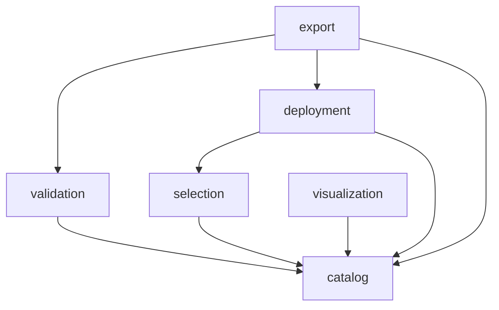

This page explains how the server code is organized: which package owns what, how a package is layered inside, and
how errors reach the client. Read it before you add a class to the server.

## Package by feature

The server code lives in `src/main/java/de/tum/cit/aet/artemis/featuremodel/`. Its top-level packages are features of
the application, not technical layers. All code for one feature, from the REST resource to the domain records, sits in
one package. When you change a feature, you change one package, and Artemis is organized the same way.

| Package | Owns |
|---|---|
| `catalog` | The runtime bundle, the feature model records, the default selection, and `GET /api/feature-model` |
| `validation` | Model integrity rules and selection validation |
| `visualization` | The tree derived from the model's features and relations |
| `selection` | The guided workflow: loading, checks, enrichment, and its endpoint |
| `deployment` | Deployment profiles, capabilities, availability, and the deployment mode ids |
| `export` | Configuration artifacts, deployment packages, static config validation, and publishing |
| `extraction` | The extraction pipeline; runs as Gradle commands, not in the web application |
| `snapshot` | The legacy snapshot administration API, off by default |
| `client` | Forwarding of Angular routes to `index.html` when the jar serves the client |
| `shared` | Cross-module exceptions and small utilities only |

## Inside a package

A feature package uses the same subpackages, and only the ones it needs:

| Subpackage | Contains |
|---|---|
| `web` | REST resources. They are thin and delegate to services. |
| `service` | The behavior of the feature. |
| `repository` | Loading data from files or the classpath. |
| `domain` | Records that describe the domain, such as `FeatureModel` or `DeploymentProfile`. |
| `dto` | Records that form the REST contract with the client. |

For example, a validation request travels from `validation/web/FeatureModelValidationResource` to
`validation/service/FeatureModelValidationService`, which loads the model through `catalog` and returns a
`ValidationResultDTO` from `validation/dto`.

## How packages depend on each other

Most packages build on `catalog`, because it owns the loaded model. The diagram shows the main directions.



`shared` sits below all of them. `extraction` uses the domain records of `catalog`, `deployment`, `export`, and
`selection` as its output contract, and the snapshot validator in `extraction` is reused by `catalog` to load a
snapshot. [Extraction Code](/developer/modules/extraction) describes the stricter rules inside `extraction`.

## Errors and controlled exceptions

When something goes wrong, the client gets JSON with a stable `code` and a readable `message`:

```json
{ "code": "DEPLOYMENT_PROFILE_NOT_FOUND", "message": "Deployment profile 'nope' does not exist." }
```

Services throw controlled exceptions from `shared/exception`. Each exception carries its code and HTTP status, and
`FeatureModelExceptionHandler` turns it into the response. Use the existing exception of your area and add a static
factory method for a new error. A raw `RuntimeException` would reach the client as an unexplained server error.

| Exception | Used for | Typical status |
|---|---|---|
| `FeatureModelLoadException` | A model, workflow, or snapshot that cannot be loaded | 500 |
| `FeatureModelIntegrityException` | A structurally invalid model or workflow | 500 |
| `DeploymentProfileException` | Unknown or unreadable deployment profiles | 404, 500 |
| `ArtifactGenerationException` | Invalid selections and unsupported export requests | 400 |
| `DeploymentRepositoryPublishException` | Publishing that is not configured or fails | 400, 409, 502 |
| `SnapshotException` | The legacy snapshot API | 400, 404 |

The REST API Reference lists the error codes.

## Add an endpoint

1. Pick the feature package that owns the behavior. Create one only for a new feature of the application.
2. Put the logic in a service in its `service` subpackage, and cover it with a focused unit test.
3. Define the request and response records in its `dto` subpackage, with explicit conversion from domain records.
4. Add a thin method to a resource in `web`, under `/api/feature-model` or `/api/deployment-profiles`.
5. Throw a controlled exception for every expected failure.
6. Add a web test for the contract, and add the endpoint to the REST API Reference.

The [Java Conventions](/developer/guidelines/java) and [API and Server Design
Conventions](/developer/guidelines/server-design) apply to every step.
