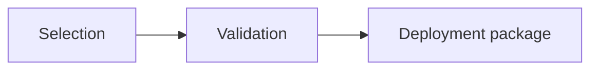

import Callout from '@site/src/components/Callout/Callout';
import { CalloutVariant } from '@site/src/components/Callout/Callout.types';

This page explains how to write a page for this documentation site. It covers where a page goes, how to structure it,
how to write in plain English, and how to check your page before you open a pull request. Every page in the Developer
Guide and the Maintainer Guide follows these rules.

## Where a page belongs

The site has two guides. The Developer Guide in `documentation/docs/developer/` is for people who change the code of
this repository. The Maintainer Guide in `documentation/docs/maintainer/` is for people who keep the feature model in
line with Artemis and run the delivery workflows. Before you write, decide who needs the page. If both groups need
it, write it for one guide and link to it from the other.

A page appears on the site only when a sidebar lists it. Add every new page to `documentation/sidebar-developer.ts`
or `documentation/sidebar-maintainer.ts` in the same change, and link to it from the pages that relate to it.

The site describes the system as it works today. Plans, design discussions, and meeting notes do not belong here.

## Frontmatter and the page title

Every page starts with three frontmatter keys:

```yaml
---
id: documentation
title: Writing Documentation
sidebar_label: Writing Documentation
---
```

The `id` is the name that the sidebar and other pages use. Keep it equal to the file name without the extension.
The `title` is the heading of the page, the title of the browser tab, and the title in search results. The
`sidebar_label` is the entry in the sidebar, so it can be shorter than the title.

Do not write an H1 heading in the body. Docusaurus renders the title as the H1 for you. The body starts with an
opening paragraph, and every heading you write is an H2 or deeper.

## Headings and links

A heading names the topic of its section. Do not number headings: Docusaurus builds the anchor of a section from the
heading text, so a number in a heading ends up in every link to that section. When you describe steps, use a
numbered list instead. Keep each heading unique within its page, and do not skip a level, for example from H2
straight to H4.

Link to another page with its site path:

```md
See [Writing Documentation](/developer/guidelines/documentation).
```

Docusaurus adds the base path of the site, so do not write `/artemis-feature-model` yourself. The build fails when a
link points to a page or an anchor that does not exist. It cannot catch a placeholder such as `[later](#)`, so never
leave one behind.

## Plain English

Write for a newcomer. Assume that the reader knows Java, Spring Boot, and Angular, but neither this project nor the
internals of Artemis.

- Open every page with one to three sentences that say what the page covers and when the reader needs it.
- Keep sentences short: aim for fewer than 25 words and one idea per sentence.
- Use the active voice and the present tense, and address the reader as "you".
- Explain why something works the way it does before you explain how to use it.
- Give a concrete example for every rule or concept: a command, a file, or a short snippet.
- Use one name for one concept. Define a term when you introduce it, and use exactly the same word everywhere else.
  The Developer Guide defines its terms on [Key Concepts](/developer/architecture/concepts).

Describe the system as it is. Do not mention project phases, pull request numbers, commit hashes, or dates, and
avoid words such as "new", "now", or "no longer". The reader looks at the current system, not at its history.

Do not copy values that change often into a page. Validation pins, image digests, snapshot ids, and feature counts
change regularly. Name the file that holds the value instead:

| Instead of | Write |
|---|---|
| Pull requests are checked against Artemis commit `3ef9968d…`. | Pull requests are checked against the Artemis commit in `delivery/artemis-validation-pin`. |
| The Explorer shows a tree of 33 features. | The Explorer shows every feature of the model as a tree. |

## Code, commands, and UI labels

Put everything that is code in backticks: file paths, class and method names, configuration keys, commands, and
literal values. Write the label of a button, tab, or field in bold, exactly as the application shows it, for example
**Configurator**. Copy the label from the Angular template of the component, not from memory.

Put commands in fenced `bash` blocks. A command runs from the repository root unless the text says otherwise:

```bash
./gradlew test
```

These pages are written in MDX, which reads `{` and `}` as code and `<` as the start of a component. Keep tokens
such as `${VARIABLE}` or `<snapshot-id>` inside backticks or code blocks, or the build fails.

## Diagrams

Draw diagrams with Mermaid in a fenced `mermaid` block. A Mermaid diagram is text, so it shows up in diffs, changes
together with the page, and follows the light and dark theme of the site:

````md

````

Keep a diagram small, with about ten nodes or fewer, and introduce it with a sentence that says what it shows.

## Screenshots

Use a screenshot only where the user interface matters, and show it with the `Image` component:

```mdx
import Image, { ImageSize } from '@site/src/components/Image/Image';
import reviewPage from './assets/configurator/review-page.png';

<Image src={reviewPage} alt="Review page of the Configurator" size={ImageSize.large} caption="The review page" />
```

Put the image file in an `assets/` folder next to the page, in a subfolder named after the page or the feature. Crop
the screenshot to the part that the text talks about, and capture it with realistic data. Delete an image as soon as
no page uses it.

## Callouts

Use the `Callout` component for information that stands apart from the text:

```mdx
import Callout from '@site/src/components/Callout/Callout';
import { CalloutVariant } from '@site/src/components/Callout/Callout.types';

<Callout variant={CalloutVariant.warning}>

Never reset or clean a checkout you work in. Use a separate, disposable Artemis checkout.

</Callout>
```

The variants are `info`, `tip`, `success`, `warning`, and `danger`. Use `warning` and `danger` only for consequences
that the reader cannot undo. A page full of warnings has no warnings.

## Page types

Most pages are one of three types. Start from the outline that matches your page.

| Type | Use it for | Outline |
|---|---|---|
| Concept | Explaining how a part of the system works | Opening, how it works (with a diagram), details, where it lives in the code, related pages |
| Task | Guiding the reader through a job | Opening that says when you need it, before you begin, numbered steps, check the result, if something goes wrong, related pages |
| Reference | Looking up values | Opening, then tables |

A task page that grows beyond about 300 lines usually covers more than one task, so split it into several pages. A
category landing page opens with one or two sentences and a table of the pages beneath it.

## Keep pages accurate

A page is useful only while it matches the code. When a pull request changes behavior that a page describes, update
the page in the same pull request.

Before you write about a part of the system, read its source files, and run every command that you show. When the
code and a page disagree, the code decides: fix the page, or report a bug if the code is wrong.

## The site is public

Anyone can read this site. Never include credentials, tokens, internal host names, IP addresses, personal file
paths, or the contents of a server inventory. Write only about what the public repository already contains.

## Build and preview

Install the dependencies once, then start the preview server in the `documentation` folder:

```bash
cd documentation
npm ci
npm run start
```

The preview runs at `http://localhost:3000/artemis-feature-model/` and reloads when you save a file. Before you open a
pull request, run the type check and the full build:

```bash
npm run typecheck
npm run build
```

A pull request that changes the documentation runs the same type check and build as a check. When the pull request is
merged into `mvp`, the site is published automatically.

<Callout variant={CalloutVariant.tip}>

Run `npm run build` before you push. The preview server accepts some mistakes, such as broken links, that the build
rejects.

</Callout>
