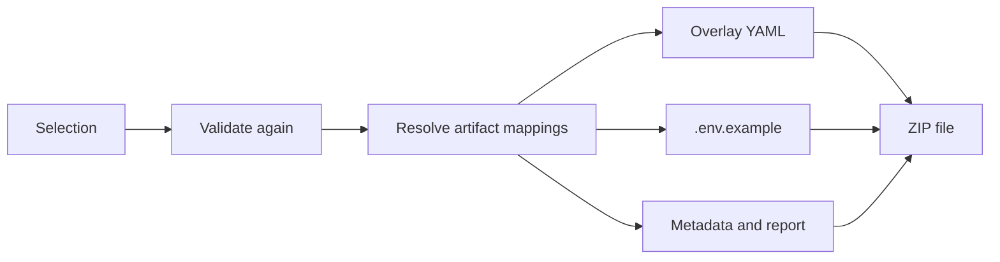

Configuration artifacts are the files that switch the selected features on in Artemis. This page explains how a
selection becomes these files and how the generated configuration is checked without starting Artemis. Every
deployment package builds on these artifacts.

## From a selection to files

The diagram shows what `ArtifactGenerationService` does with a selection.



The service validates the selection with the same rules as the validation endpoint and refuses an invalid one with
`ARTIFACT_GENERATION_INVALID_SELECTION`. It then resolves the artifact mappings of all features and writes the files
in memory. The result is the same for the same input, byte for byte.

## The configuration overlay

The overlay `config/application-feature-model.yml` contains every artifact mapping that targets this file:

```yaml
artemis:
  text:
    enabled: true
  athena:
    enabled: false
  atlas:
    enabled: true
    chat-model: ${ARTEMIS_ATLAS_CHAT_MODEL}
```

A `selection` mapping is written for every feature, with the selected or the deselected value, so the overlay states
each module explicitly. An `environment` mapping is written only when its feature is selected, and always as a
placeholder. Artemis loads the overlay as additional Spring configuration, and Spring fills the placeholders from the
environment.

The name of a placeholder comes from the configuration path: `artemis.atlas.chat-model` becomes
`ARTEMIS_ATLAS_CHAT_MODEL`. The model integrity check rejects two mappings that would produce the same name.

## Environment variables and secrets

`env/.env.example` lists every placeholder of the overlay with an empty value and a comment that names its feature,
configuration key, and type. A mapping marked `secret` gets a comment that says to take the value from the
deployment's secret store. The application never writes a secret value.

Generation always runs in `DEMO` mode, and the files say so. The local Docker and IDE packages add visibly fake demo
values on top, so that a local test starts without any setup.

## Metadata and report

| File | Content |
|---|---|
| `metadata/selected-features.json` | The selected features with their names |
| `metadata/deployment-profile-summary.json` | The profile the files were generated against |
| `metadata/generation-report.json` | Status, warnings, and the environment variables the deployment must provide |
| `README.md` | What the files are and how to use them |

## Static validation of the overlay

A typo in a configuration key would make Artemis ignore the setting silently. `StaticConfigValidationService`
therefore checks the generated overlay against the Artemis config-key catalog,
`src/main/resources/feature-model/artemis-config-key-catalog.json`. Every key must exist in the catalog, and every
value must have the catalog type: `boolean`, `string`, or `url`. A placeholder passes every type check, because its
value is only known at deployment time.

The check needs no running Artemis, so it runs in several places with the same rules:

- Every deployment package contains its result as `metadata/static-config-validation.json`.
- The package's runtime checks include it as `static-config-keys`, and its `validate-package.sh` script fails on it.
- `StaticConfigValidationServiceTest` fails when a mapping in the model uses a key that the catalog does not contain.

The extraction pipeline generates the catalog from the configuration defaults in the Artemis source, together with
the model, so the two stay in step.

## The download endpoint

`POST /api/feature-model/artifacts/download` returns the configuration artifacts alone as
`artemis-feature-model-artifacts.zip`. The review page of the Configurator offers
[deployment packages](/developer/modules/deployment-packages) instead, which contain these artifacts.

## Where it lives in the code

| Path | Responsibility |
|---|---|
| `export/service/ArtifactGenerationService` | Validates the selection and assembles the artifacts |
| `export/service/ArtifactMappingResolver` | Turns mappings into overlay entries and environment requirements |
| `export/service/YamlOverlayWriter` | Writes the overlay YAML |
| `export/service/EnvExampleWriter` | Writes `.env.example` |
| `export/service/StaticConfigValidationService` | Checks the overlay against the catalog |
| `export/service/ArtifactPackageService` | Packs files into a deterministic ZIP |
| `export/web/ArtifactGenerationResource` | The download endpoint |

Paths are relative to `src/main/java/de/tum/cit/aet/artemis/featuremodel/`.
