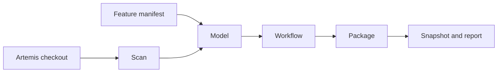

The extraction pipeline builds the feature model from the Artemis source code. This page shows how its code is
organized and how to extend it. What the pipeline does, how to run it, and how to fix a failed run are maintainer
topics, covered in the Maintainer Guide under [Extraction System](/maintainer/extraction).

## Where extraction runs

Extraction is not part of the web application. It runs as Gradle tasks that start plain Java command-line programs
without a Spring context. A user of the application can never trigger it.

| Gradle task | Program | Purpose |
|---|---|---|
| `featureModelManifestPreflight` | `FeatureExtractionCli` | Checks the manifest and prints the Artemis revision it would use |
| `extractFeatureCandidates`, `assembleFeatureModel`, `prepareGuidedWorkflow`, `packageFeatureModelSnapshot` | `FeatureExtractionCli` | The four stages: scan, model, workflow, and package |
| `buildFeatureModelSnapshot` | the four stage tasks | Runs all stages in order |
| `validateFeatureModelSnapshot` | `FeatureModelSnapshotValidatorCli` | Validates a finished snapshot |
| `stageFeatureModelDockerContext` | `FeatureModelDockerContextCli` | Prepares a snapshot for the Docker image build |
| `refreshFeatureModelFixture` | `FeatureModelFixtureRefreshCli` | Copies a snapshot's model and catalog over the classpath resources |
| `syncGuidedWorkflowScaffold` | `GuidedWorkflowScaffoldRunner` | Adds placeholder options for new features to the guided workflow |

All of them belong to the Gradle group `feature model`, so `./gradlew tasks --group "feature model"` lists them.
`build.gradle` passes every input to the programs explicitly.

## How the stages fit together

Each stage is one command with one output directory. Only the scan reads the Artemis checkout; the later stages read
the output of the previous stage and check its digest first, so they never combine stale or foreign files.

## Package layout

The code lives in `src/main/java/de/tum/cit/aet/artemis/featuremodel/extraction/`:

| Package | Owns |
|---|---|
| `source` | Read-only access helpers: the Artemis paths and symbols the scanners look for (`ArtemisSourceConventions`), checkout location, Java parsing |
| `repository` | `ArtemisSourceRepository`, the only way to read files from the checkout |
| `scan` | The scanners and the assemblers that turn their facts into feature candidates; entry point `ScanStageService` |
| `model` | Curation against the manifest, model and catalog generation, conformance checks; entry point `ModelStageService` |
| `workflow` | Workflow validation against the generated model, and the scaffold sync; entry point `WorkflowStageService` |
| `snapshot` | Snapshot publication, validation, and Docker context staging; entry point `PackageStageService` |
| `report` | The extraction report and its HTML rendering |
| `pipeline` | Shared run infrastructure: run identity, inputs, manifest loading, and the digest-checked artifact store |
| `domain` | The records written to disk: scan results, envelopes, findings, snapshot contracts |
| `artifact` | Deterministic JSON bytes and SHA-256 digests |
| `annotation` | The `@ArtemisFeature` source annotation contract |

The packages depend on each other in one direction only. `pipeline` and `report` never depend on a stage package,
and the stage packages never depend on each other. `ExtractionPackageDependencyGuardTest` reads the imports and fails
when a class breaks these rules, so check its allowed list before you add an import across packages.

## Add a scanner

1. Create a class ending in `Scan` in `scan`. Read files only through `ArtemisSourceRepository`, and put every Artemis
   path or symbol you look for into `ArtemisSourceConventions`.
2. Return plain facts. Do not decide membership in the model; the manifest and the model stage do that.
3. Run the scanner from `FeatureExtractionService`. It wraps every scanner so that a crash becomes a report finding
   instead of an exception.
4. Pass the facts to the candidate assembler that needs them.
5. Add the source files your scanner reads to the small fake Artemis tree in
   `src/test/resources/extraction/mini-artemis/`, and test the scanner against it.

## Add a check

A check produces findings with a code and a severity. Findings with severity `error` stop the run and appear in the
report; warnings appear without stopping it.

- Checks of the manifest and the generated model belong in `model`, next to `ScopeCurationService` and the
  conformance services.
- Checks of the guided workflow belong in `GuidedWorkflowDiagnosticsService` in the `selection` package. The server
  logs the same findings at runtime, so both sides share one rule set.

## Test fixtures

| Fixture | Use |
|---|---|
| `src/test/resources/extraction/mini-artemis/` | A tiny fake Artemis checkout with every file type the scanners read |
| `src/test/resources/extraction/broken-artemis/` | A checkout with unparsable files, for the fail-soft scanner paths |
| `src/test/resources/extraction/annotated-artemis/` | A checkout with `@ArtemisFeature` annotations |
| `src/test/resources/extraction/fixture-inputs/` | Manifests, models, and workflows for stage tests |
| `ExtractionTestModels` | In-memory models and catalogs that match `mini-artemis` |

`ExtractionPipelineCharacterizationTest` runs all stages over `mini-artemis` and checks their outputs, so it is the
first test to run after a change. `RealArtemisCheckoutSmokeTest` runs the pipeline against a real checkout when you
pass `-PartemisPath` to `./gradlew test`.
