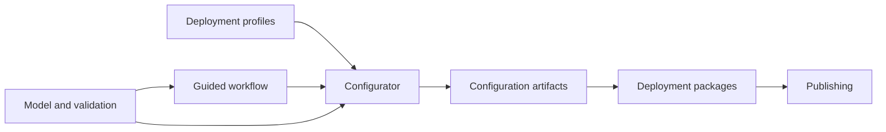

A module is one functional part of the application, with its server package, its client area, or both. Each page
below explains what one module does, how its parts work together, and where to change it.

| Module | Server package | Client area | Page |
|---|---|---|---|
| Model and validation | `catalog`, `visualization`, `validation` | `core`, `validation` | [Model and Validation](/developer/modules/model-and-validation) |
| Guided workflow | `selection` | `configurator/guided` | [Guided Workflow](/developer/modules/guided-workflow) |
| Deployment profiles | `deployment` | `configurator` | [Deployment Profiles](/developer/modules/deployment-profiles) |
| Configuration artifacts | `export` | `configurator/guided` | [Configuration Artifacts](/developer/modules/configuration-artifacts) |
| Deployment packages | `export` | `configurator/shared` | [Deployment Packages](/developer/modules/deployment-packages) |
| Publishing | `export` | `configurator/guided` | [Publishing](/developer/modules/deployment-publishing) |
| Extraction | `extraction` | none | [Extraction Code](/developer/modules/extraction) |
| Explorer | none | `explorer` | Explorer |
| Configurator | none | `configurator` | Configurator |
| Client foundations | none | `core`, `api`, `validation` | Client Foundations |

## How the modules work together

The diagram follows one configuration from the loaded model to a deployment package.

The model module loads and checks the model. The guided workflow and the deployment profiles build on it, and the
Configurator combines all three for the user. When the selection is valid, the export modules turn it into files:
configuration artifacts first, then a deployment package around them, which publishing can commit to a repository.
