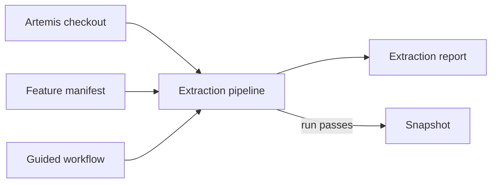

The extraction pipeline builds the feature model from the Artemis source code. This page explains what goes in, what
comes out, and why the pipeline stops instead of guessing. Read it before you run the pipeline for the first time.

## Why extraction exists

A hand-written feature model drifts away from Artemis as soon as Artemis changes. The pipeline reads the facts from
the source instead: which modules exist, which configuration keys switch them on, which Spring profiles and Docker
Compose files select the database or the CI provider. The modeling decisions that code cannot express stay with you,
in the [feature manifest](/maintainer/extraction/manifest).

## Inputs and outputs

The diagram shows the three inputs of a run and its two outputs.

The pipeline reads a clean Artemis checkout, the feature manifest, and the authored guided workflow
`src/main/resources/feature-model/guided-workflow.json`. It also reads two small files of this repository: the bundled
deployment profile and `delivery/artemis-runtime-image.json`. It always writes a report. Only a run without blocking
findings also writes a [snapshot](/maintainer/extraction/snapshots), the unit that the delivery workflows publish.

## The four stages

The pipeline runs in four stages. Each stage is one Gradle task, and each writes into its own directory.

1. **Scan** reads the Artemis checkout and lists every candidate with its evidence. It is the only stage that reads
   Artemis.
2. **Model** applies the manifest to the candidates, assembles the generated model and the config-key catalog, and
   checks that the result matches the manifest.
3. **Workflow** checks the authored guided workflow against the generated model.
4. **Package** writes the report and, when nothing blocks, the snapshot.

[Stages and Artifacts](/maintainer/extraction/stages) describes each stage and its files.

## Fail-closed by design

The pipeline stops when it meets something the manifest does not decide: a new Artemis module, a dependency between two
features without a constraint, or an anchor that no longer exists. It does not guess, because a guess would publish a
model that looks valid but is wrong.

A stopped run is not an error in the pipeline. It tells you that Artemis changed and that the manifest needs a
decision. The report names the gap, and [Fix a Failed Run](/maintainer/tasks/fix-failed-extraction) shows how to close
it.

## What extraction never does

The pipeline only reads files. It never changes the Artemis checkout, never compiles or starts Artemis, and never loads
Artemis classes. It runs as plain Java programs through Gradle, outside the web application.

## Pages in this section

| Page | Covers |
|---|---|
| [Run the Pipeline Locally](/maintainer/extraction/running-locally) | Running the pipeline on your machine |
| [Stages and Artifacts](/maintainer/extraction/stages) | What each stage reads and writes |
| [The Feature Manifest](/maintainer/extraction/manifest) | The file you edit to curate the model |
| [Curation and Conformance](/maintainer/extraction/curation-and-conformance) | The checks that decide whether a run passes |
| [Source Scanners](/maintainer/extraction/source-scanners) | What the pipeline reads from Artemis |
| [Read the Report](/maintainer/extraction/reports) | Understanding the result of a run |
| [Snapshots](/maintainer/extraction/snapshots) | The output that delivery publishes |
