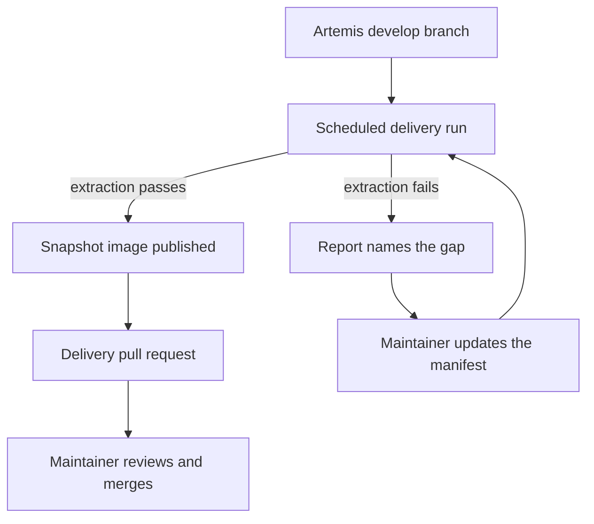

This guide is for people who keep the Artemis Feature Model in line with Artemis. It explains why the model needs
regular care, how the delivery workflows support you, and when they need a decision from you.

## Why the model needs maintenance

Artemis changes every week. Features appear, change their configuration, or disappear. The feature model has to
follow these changes, or the Configurator offers choices that no longer match Artemis.

An extraction pipeline reads the Artemis source code and builds the feature model from it, but it does not guess. A
curated file, the feature manifest, decides which Artemis features belong to the model and how they are arranged.
When the pipeline finds a feature or a relation that the manifest does not cover, it stops and reports the gap
instead of building a model that might be wrong. A maintainer then decides how the model should change.

## The maintenance loop

The diagram shows how a change in Artemis reaches the feature model.

A workflow runs on a schedule. It takes the latest commit of the Artemis `develop` branch and runs the extraction
pipeline against it. When the pipeline passes, the workflow publishes a container image that contains the new model,
called a snapshot image. It then opens a delivery pull request, which refreshes the copy of the model that local
development uses and records the Artemis commit that the model was validated against.

When the pipeline fails, the workflow run fails, and its report names what the manifest is missing. You update the
manifest in a pull request, and the next run picks up your change.

Publishing an image does not deploy it. To mark an image as verified, you promote it with a workflow; to roll back,
you promote an earlier image.

## What you do as a maintainer

Most of the work is routine: you check each scheduled run and review the delivery pull request it opens. Other work
comes up when Artemis changes in a way the pipeline cannot decide on its own. Then you update the feature manifest,
write the guided workflow text that the Configurator shows for a new feature, or update the Ansible binding catalog
so that the remote deployment package supports the change. From time to time, you promote an image or roll one back.

## Where to start

1. Set up your machine with [Setup](/maintainer/setup) and learn the terms on [Concepts](/maintainer/concepts).
2. Read [How Extraction Works](/maintainer/extraction) and run the pipeline once with
   [Run the Pipeline Locally](/maintainer/extraction/running-locally).
3. Read [How Delivery Works](/maintainer/pipeline) to see what the workflows do for you.
4. Keep [Maintenance Tasks](/maintainer/tasks) at hand: it has a page for every job in the loop above.

When something fails, start with [Troubleshooting](/maintainer/troubleshooting). For the code of the application, see
the [Developer Guide](/developer/intro).
