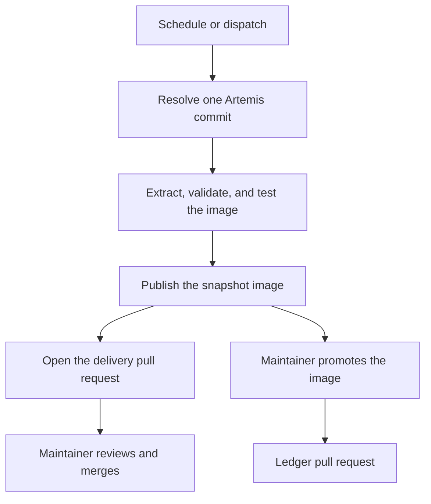

The delivery pipeline turns a new Artemis commit into a published snapshot image and a pull request for you to review.
This page gives the overview: what runs when, what it produces, and what stays manual.

## The delivery loop

The diagram shows one round, from an Artemis commit to an approved image.

Every step works on one fixed Artemis commit. The workflow resolves the latest commit of the Artemis `develop`
branch once at the start, or takes the commit you pass in, and uses exactly that commit until the end. A run can
therefore always be repeated and explained.

## On every pull request

Every pull request in this repository runs the **Model delivery gates** check next to the application tests. It checks
out Artemis at the commit in `delivery/artemis-validation-pin`, runs the extraction pipeline, validates the snapshot,
builds the image, and starts it once to test it. It never publishes anything.

Because the pin is a fixed commit, the check gives the same result on every run of the same pull request. Changes in
Artemis cannot break your pull request; they reach this repository only through a delivery pull request.

## On a schedule

Twice a week, the **Artemis delivery poller** takes the latest Artemis commit. Unless the same snapshot was already
published from the current state of this repository, it:

1. validates the commit with the same steps as the pull request check;
2. publishes the tested image to the GitHub Container Registry, tagged with its snapshot id;
3. opens a delivery pull request that refreshes the classpath fixture, moves the validation pin to the new commit, and
   lists features that the guided workflow does not cover yet.

When the extraction fails, the run fails and nothing is published. The report names the gap, and you fix it in an
ordinary pull request. [Fix a Failed Run](/maintainer/tasks/fix-failed-extraction) shows how.

## Promotion and rollback

A published image is not yet approved. When you decide an image is good, you promote it: a workflow moves the
`verified` tag to the image and opens a pull request that records the promotion in the verified-image ledger. To roll
back, you promote an earlier image from the ledger. Nothing is rebuilt in either case.

## What stays manual

The pipeline never deploys an image and never publishes a `latest` tag. Running an image on a server is a separate
decision. The [manifest cutover](/maintainer/tasks/manifest-cutover) is also manual.

## Pages in this section

| Page | Covers |
|---|---|
| [Workflows](/maintainer/pipeline/workflows) | Every workflow file, its triggers, and its permissions |
| [Delivery Files](/maintainer/pipeline/delivery-files) | The files that control delivery, and who changes them |
| [Images and Runtime](/maintainer/pipeline/images) | Image identity, tags, labels, and how to run an image |
| [Repository Settings](/maintainer/pipeline/repository-settings) | Environments and permissions the workflows need |
